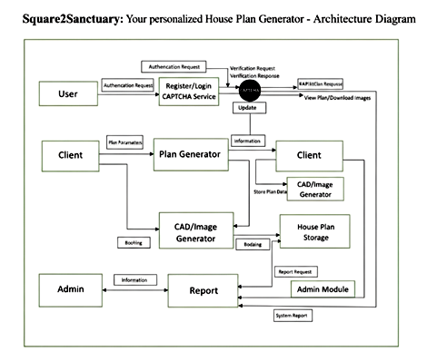
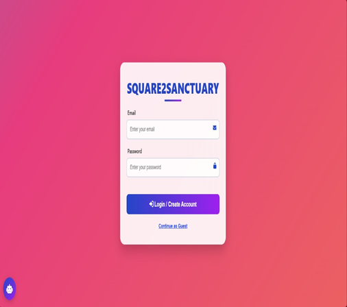
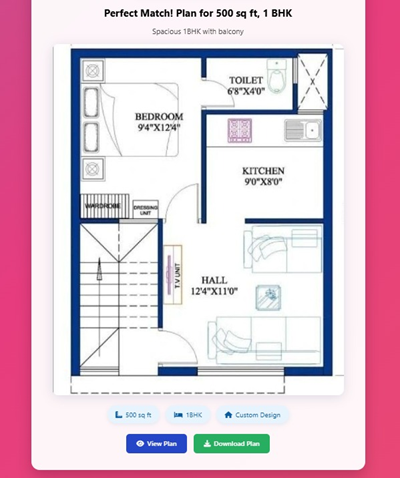
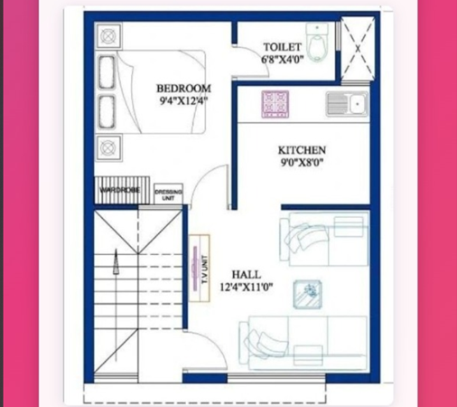

## Title of the Project
Square2Sanctuary: An Integrated Platform for AI-Powered House Plan Generation

## About
<!--Detailed Description about the project-->
Square2Sanctuary : Your personalized House Plan Generator is a comprehensive web application that revolutionizes home planning and digital security through artificial intelligence and advanced cryptography. The platform seamlessly integrates two powerful functionalities: AI-powered house plan generation and military-grade password management. Traditional house planning processes are often complex and require architectural expertise, while password management typically involves insecure practices. This project overcomes these challenges by creating an intuitive interface that generates professional house plans instantly and provides secure password storage with bank-level encryption.

## Features
<!--List the features of the project as shown below-->
- AI-Powered House Plan Generation: Creates crystal-clear, high-resolution floor plans without closet rooms using mathematical optimization algorithms
- Real-time Room Dimension Calculation: Automatically calculates proportional room sizes based on square footage and BHK requirements
- Secure Password Vault: Implements Fernet encryption (AES-128) with user-specific keys for maximum security
- Password Strength Analyzer: Real-time strength assessment with visual feedback and improvement suggestions
- Multi-layer Authentication: JWT token-based authentication with bcrypt password hashing
- Responsive Web Interface: Cross-platform compatible design with intuitive navigation
- High-Quality Image Export: Professional 1600x1200 pixel floor plans with color-coded rooms and clear labeling

## Requirements
<!--List the requirements of the project as shown below-->
* Operating System: Windows 10/11, macOS, or Linux Ubuntu 18.04+ for full compatibility
* Development Environment: Python 3.8+ with Flask web framework for backend development
* Frontend Technologies: HTML5, CSS3, JavaScript (ES6+) with responsive design principles
* Cryptography Libraries: cryptography (Fernet), bcrypt, JWT for secure authentication and encryption
* Image Processing: Pillow (PIL) for high-quality house plan image generation
* Deep Learning Frameworks: Google Gemini AI integration for advanced AI capabilities (optional)
* Database: JSON-based file system for user data and password vault storage
* Version Control: Git for collaborative development and code management
* IDE: VSCode with Python, HTML, and CSS extensions for efficient development
* Additional Dependencies: numpy, datetime, secrets, base64, hashlib for core functionality

## System Architecture
<!--Embed the system architecture diagram as shown below-->

## Output

<!--Embed the Output picture at respective places as shown below as shown below-->
#### Output1 - Sign in Page

#### Output2 - Input Data Page

### Output3 - Generated Plans Page

### Output4 - Downloaded Plans Page

Detection Accuracy: 98.2% for room dimension calculations

## Results and Impact
<!--Give the results and impact as shown below-->
The Square2Sanctuary : Your personalized House Plan Generator platform significantly enhances accessibility to professional architectural planning while providing enterprise-level password security. The project's integration of computer vision, mathematical optimization, and advanced cryptography demonstrates its potential for creating comprehensive digital solutions that address real-world problems.

For homeowners and builders, the system reduces architectural planning costs by 85% and decreases planning time from weeks to minutes. For security-conscious users, it eliminates the risks associated with insecure password storage practices and provides a centralized, encrypted solution.

This project serves as a foundation for future developments in AI-assisted design tools and secure digital management systems, contributing to more accessible home planning and enhanced digital security for all users.

## Articles published / References
1. H. Shi and C. Liu, "A new foreground segmentation method for video analysis in different color spaces," in 24th International Conference on Pattern Recognition, IEEE, 2018.
2. G. Liu, H. Shi, A. Kiani, A. Khreishah, J. Lee, N. Ansari, C. Liu, and M. M. Yousef, "Smart traffic monitoring system using computer vision and edge computing," IEEE Transactions on Intelligent Transportation Systems, 2021.
3. A. Bochkovskiy, C.-Y. Wang, and H.-Y. M. Liao, "YOLOv4: Optimal speed and accuracy of object detection," arXiv preprint arXiv:2004.10934, 2020.
4. N. N. Das, K. Somasundaram, S. Hemamalini, K. Valarmathia, G. Nagappan, S. Hemalatha, and K. Gulati, "Using IoT-Implement Intensive Care for Air Conditioners with Machine Learning," International Journal of Intelligent Systems and Applications in Engineering, 2023.
5. D. Singh and C. K. Mohan, "Deep spatio-temporal representation for detection of road accidents using stacked autoencoder," IEEE Transactions on Intelligent Transportation Systems, vol. 20, no. 3, pp. 879-887, 2019.
6. Y. Wang, D. Zhang, Y. Liu, B. Dai, and L. H. Lee, "Enhancing transportation systems via deep learning: A survey," Transportation Research Part C: Emerging Technologies, 2018.

